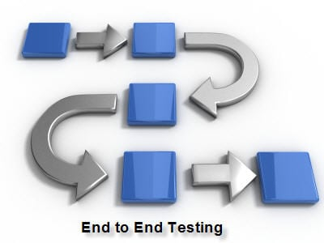
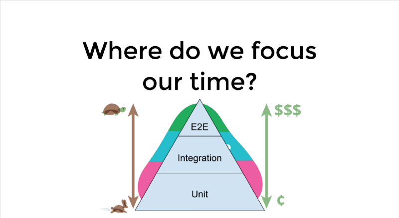
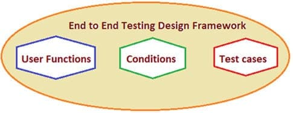

# E2E Testing Framework with Recipe

## What is End-to-End Testing?
End-to-end (E2E) testing is a Software testing methodology to test an application flow from start to end. The purpose of End to end testing is to simulate the real user scenario and validate the system under test and its components for integration and data integrity.

It is performed from start to finish under real-world scenarios like communication of the application with hardware, network, database and other applications.

E2E tests allow us to cover sections of the application that unit tests and integration tests don’t cover. This is because unit tests and integration tests only take a small piece of the application and assess that piece in isolation. Even if these pieces work well by themselves, you don’t necessarily know if they’ll work together as a whole. Having a suite of end-to-end tests on top of unit and integration tests allows us to test our entire application.

## Unit vs Integration vs E2E Testing
Let's examine the main features of each testing methodology and create a comparison analysis between Unit testing, Integration testing and End-to-End testing:

| Unit Test | Integration Test | E2E Test |
|-----------|------------------|----------|
| A module, APIs | Modules, Interfaces | Application, System |
| Tiny | Small to Medium | Large |
| Transparent | Black box | Black box |
| Isolated | Test interfaces and flow data between the modules | Application flow from start to end

The main reason for carrying out E2E testing is to determine various dependencies of an application as well as ensuring that accurate information is communicated between various system components. It is usually performed after the completion of functional and system testing of any application.

## Why Do We Perform E2E Testing?
In many commercial software application scenarios, a modern software system comprises of its interconnection with multiple sub-systems. These sub-systems can be within the same organization or can be components of different organizations. Also, these sub-systems can have somewhat similar or different lifetime release cycle from the current system. As a result, if there is any failure or fault in any sub-system, it can adversely affect the whole software system leading to its collapse.

The above illustration is a testing pyramid from [Kent C. Dodd’s blog](https://blog.kentcdodds.com/write-tests-not-too-many-mostly-integration-5e8c7fff591c) which is a combination of the pyramids from [Martin Fowler’s blog](https://martinfowler.com/bliki/TestPyramid.html) and the [Google Testing Blog](https://testing.googleblog.com/2015/04/just-say-no-to-more-end-to-end-tests.html).

The majority of your tests are at the bottom of the pyramid. As you move up the pyramid, the number of tests gets smaller. Also, going up the pyramid, tests get slower and more expensive to write, run, and maintain. Therefore, before delving yourself in E2E testing specifications and planning, it is important to keep the checklist of the ***essential activities that should be included in every E2E process***:
- A thorough study of requirements to perform E2E testing.
- Proper set up of test environments.
- A thorough study of Hardware and Software requirements.
- Descriptions of all subsystems as well as main software system involved.
- Enlist the roles and responsibilities for all the systems and subsystems involved.
- Testing methods used under E2E testing as well as standards that are followed, its description.
- Test cases designing as well as tracing requirement matrix.
- Record or save the input and output data for each system.

When working on large and complex customer engagements, it is very important to perform E2E testing in a controlled environment, and for a good reason. Even  slight change in the sub-system implementation, the interface contract, data schema, etc. can cause interface conflicts. Therefore, we need **constantly** and **automatically** control E2E tests to manage the scope and breadth of the conflicts.

## E2E Testing Methods

### Horizontal Test
This method is used very commonly. It occurs horizontally across the context of multiple applications. Take an example of a web-based application of an online ordering system. The whole process will include accounts, inventory status of the products as well as shipping details.

### Vertical Test
In this method, all the transactions of any application are verified and evaluated right from the start to finish. Each individual layer of the application is tested starting from top to bottom. Take an example of a web-based application that uses middleware API for reaching back-end services. In such case, API is required to be fully tested against both, the underlying back-end services and the top layer UI web interface. All these complex testing scenarios will require proper validation and dedicated automated testing. Thus this method is much more difficult.

Below enlisted are few **guidelines** that should be kept in mind while designing the test cases for performing E2E testing:

- Test cases should be designed from the end user’s perspective.
- Should focus on testing some existing features of the system.
- Multiple scenarios should be considered for creating multiple test cases.
- Different sets of test cases should be created to focus on multiple scenarios of the system.

## E2E Testing Design Framework

We will look into all the 3 categories one by one:

### User Functions
Following actions should be performed as a part of building user functions:

   - List user initiated functions of the software systems and their interconnected sub-systems.
   - For any function, keep track of the actions performed as well as Input and Output data.
   - Find the relations, if any between different Users functions.
   - Find out the nature of different user functions i.e. if they are independent or are reusable.

### Conditions
Following activities should be performed as a part of building conditions based on user functions:

   - For each and every user functions, a set of conditions should be prepared.
   - Timing, data conditions and other factors that affect user functions can be considered as parameters.

### Test Cases
Following factors should be considered for building test cases:

   - For every scenario, one or more test cases should be created to test each and every functionality of the user functions.
   - Every single condition should be enlisted as a separate test case.

## E2E Testing Progress Tracking
Moving to the next important activities involved in every E2E testing:

- **Status of Test case preparation**: This can be tracked in the form of a dashboard percentage completion to represent the progress of the planned test cases that are under preparation.
- **Weekly tracking of Test progress**: This includes week wise representation of the test cases execution progress. It can be reflected through percentage representation for a pass, fail, executed, not executed, invalid, etc cases.
- **Status and detailed report for Defects**: The Status report should be prepared on a daily basis to show the test case execution status as well as defects found and logged as per their severity. Weekly, the percentage of the open and closed defects should be calculated. Also, based on defect severity and priority, defects status should be tracked on a weekly basis.
- **Test environment**: This keeps a track of the test environment time duration allotted as well as the test environment time actually used while performing E2E testing.

## E2E Testing Frameworks and Tools

### **1) Gauge Framwork** 

Gauge is a free and open source framework for writing and running E2E tests. Some of the key features of Gauge that makes it unique include:

- Simple, flexible and rich syntax based on Markdown.
- Consistent cross platform/language support for writing test code.
- A modular architecture with plugins support
- Extensible through plugins and hackable.
- Supports data driven execution and external data sources
- Helps you create maintainable test suites
- Supports Visual Studio Code, Intellij IDEA, IDE Support

=> [Visit Gauge Framework Website](https://gauge.org/)

### **2) TestCraft** 

TestCraft is a codeless Selenium test automation platform. Its revolutionary AI technology and unique visual modeling allow for faster test creation and execution while eliminating test maintenance overhead.

The testers create fully automated test scenarios without coding. Customers find bugs faster, release more frequently, integrate with the CI/CD approach and improve the overall quality of their digital products. This all is creating a complete end to end testing experience.

=> [Visit TestCraft Website](https://www.testcraft.io/?utm_campaign=SoftwareTestingHelp%20&utm_source=SoftwareTestingHelp&utm_medium=EndtoEndTestingPage) or get it  from the [Visual Studio Marketplace](https://marketplace.visualstudio.com/items?itemName=testcraft.build-release-task)

### **3) Ranorex Studio** 

**Ranorex Studio** is a complete end-to-end test automation tool for desktop, web, and mobile applications. Create reliable tests fast without any coding at all, or using the full IDE. Use external CSV or Excel files or a SQL database as inputs to your tests.

Run tests in parallel or on a Selenium Grid with built-in Selenium WebDriver. Ranorex Studio integrates with your CI/CD process to shorten your release cycles without sacrificing quality.

**Ranorex Studio** tests also integrate with Azure DevOps (AzDO), which can be run as part of a build pipeline in AzDO.

=> [Visit Ranorex Studio Website](https://www.ranorex.com/ranorex-studio-test-automation/?utm_source=softwaretestinghelp&utm_medium=cpc&utm_campaign=softwaretestinghelp_what-is-end-to-end-testing) or read about its [integration with AzDO](https://www.ranorex.com/help/latest/interfaces-connectivity/azure-devops-integration/introduction/)

### **4) Katalon Studio** 

**Katalon Studio** is an excellent end-to-end automation solution for web, API, mobile, and desktop testing with DevOps support.

With Katalon Studio, automated testing can be easily integrated into any CI/CD pipeline to release products faster while guaranteeing high quality. Katalon Studio customizes for users from beginners to experts. Robust functions such as Spying, Recording, Dual-editor interface and Custom Keywords make setting up, creating and maintaining tests possible for users.

Built on top of Selenium and Appium, Katalon Studio helps standardize your end-to-end tests standardized. It also complies with the most popular frameworks to work seamlessly with other tools in the automated testing ecosystem.

Katalon is endorsed by Gartner, IT professionals, and a large testing community.

>Note: At the time of this writing, Katalon Studio extension for AzDO was NOT available for Linux.

=> [Visit Katalon Studio Website](https://www.katalon.com/) or read about its [integration with AzDO](https://docs.katalon.com/katalon-studio/docs/azure-devops-extension.html#installation)

## Conclusion
Hope you learned various aspects of E2E testing like its processes, metrics, the difference between Unit, Integration  and E2E testing, and the various recommended E2E test frameworks and tools.

For any commercial release of the software, E2E test verification plays an important role as it tests the entire application in an environment that exactly imitates real-world users like network communication, middleware and backend services interaction, etc.

Finally, the E2E test is often performed manually as the cost of automating such test cases is too high to be afforded by any organization. 